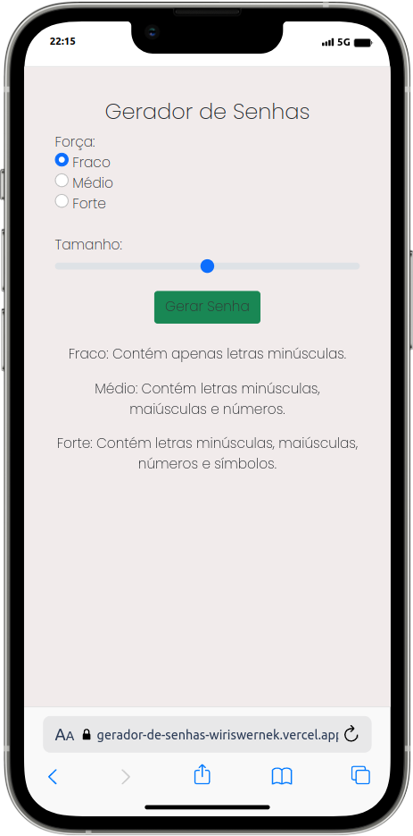

# Gerador de Senhas 

## Sobre

O projeto é aplicação para geração de senhas criado para trabalhar conceitos de DOM.

Atualmente o projeto se encontra publicado na [Vercel](https://github-consumer-wiriswernek.vercel.app), e usa como base HTML, CSS, Bootstrap e JS.

Segue abaixo uma prévia da aplicação.

<h2 align="center">Preview Desktop</h2>

	

<h2 align="center">Preview Mobile</h2>

	

<h2 align="center">Preview em Vídeo</h2>

	

## Como executar esta aplicação?

Para rodar a aplicação voce deve:
- Primeiro clonar este repositório
- Navegar para a pasta `GeradorDeSenhas`
- Pode utilizar a extensão Live Server do Visual Studio Code para abrir o projeto ou utilizar o seu navegador para abrir o arquivo `index.html` 